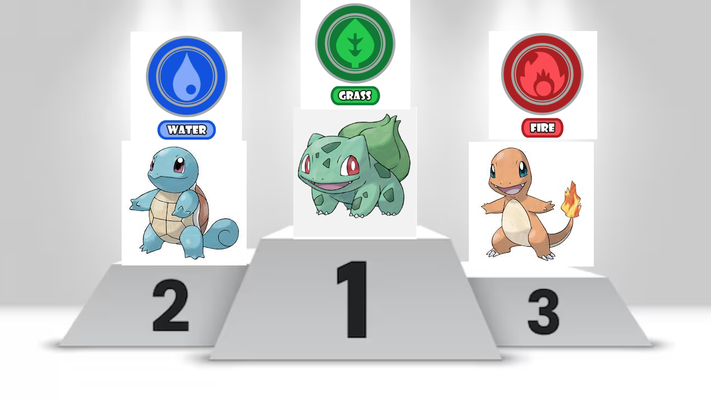

¿Que starter de cada generación es el mas querido por el pokefandom?

Descubre a los mejores Pokémon iniciales según los fans!!

En 2020 Google lanzó una encuesta al mundo entero en la cual los fans de Pokemon tenian que votar cual es su pokemon favorito de cada generacion esta tuvo una gran repercusión  Y como era de esperar los pokemon iniciales estaban siempre presentes en los 30 mas votados de cada generacion ya que como se sabe este tipo de pokemon suelen recibir mucho cariño por parte de los jugadores. A continuacion basandonos en esos datos conoceras el puesto en el que los pokemon iniciales (starters) han quedado compitiendo entre ellos se realizara un top 3. 

Primera generacion (Kanto)

Cuando se habla de los tres starters que protagonizan la primera generacion podemos decir que son los 3 mas famosos y queridos por el fandom.                                                                                                   Los resultados fueron sorprendentes ya que charmander fue de los 3 el menos votado con 14.049 votos quedando asi en el puesto 17 de todos los pokemon que componen la primera generación, seguido de Squirtle con 18.476 votos quedando en el puesto 13, pero ambos derrotados sorprendetemente por el unico inicial que no aparece en ninguna de las dos portadas disponibles en todo el mundo de los videojuegos que pertenecen a la generacion de Kanto, Bulbasaur quedando en top 3 mas votados de toda la pokedex de Kanto y con la friolera de 56.015 votos

